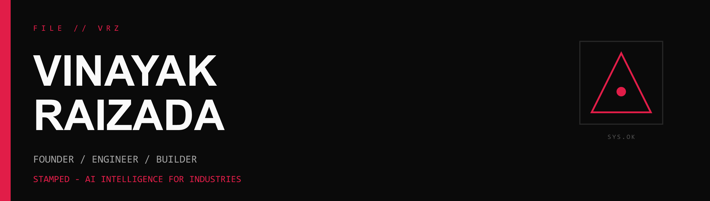
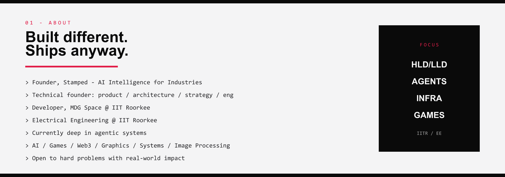
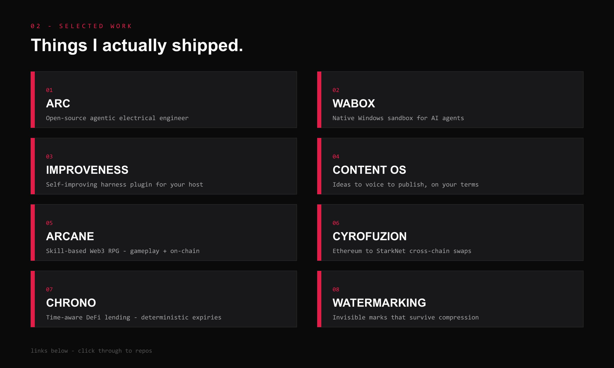
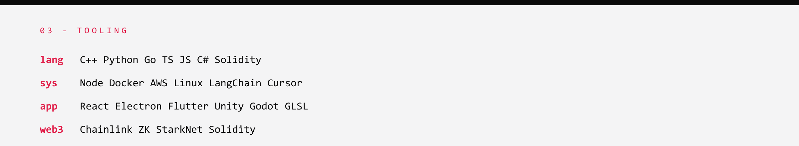

 

**[Stamped](https://stamped.work)**
&nbsp;&nbsp;|&nbsp;&nbsp;
**[LinkedIn](https://www.linkedin.com/in/vinayak-rz/)**
&nbsp;&nbsp;|&nbsp;&nbsp;
**[Email](mailto:vinayakraizada@gmail.com)**
&nbsp;&nbsp;|&nbsp;&nbsp;
**[GitHub](https://github.com/Vinayak-RZ)**

 

 

| # | Project | Link |
|:-:|:--------|:-----|
| 01 | **ARC** | [Vinayak-RZ/ARC](https://github.com/Vinayak-RZ/ARC) |
| 02 | **WABOX** | [Vinayak-RZ/WABOX](https://github.com/Vinayak-RZ/WABOX) |
| 03 | **Improveness** | [Vinayak-RZ/Improveness](https://github.com/Vinayak-RZ/Improveness) |
| 04 | **Content OS** | [Vinayak-RZ/Content-OS](https://github.com/Vinayak-RZ/Content-OS) |
| 05 | **Arcane** | [ArcaneStdio/Chains-Of-Eternity](https://github.com/ArcaneStdio/Chains-Of-Eternity) |
| 06 | **CyroFuzion** | [Vinayak-RZ/CyroFuzion](https://github.com/Vinayak-RZ/CyroFuzion) |
| 07 | **Chrono** | [ArcaneStdio/Chrono](https://github.com/ArcaneStdio/Chrono) |
| 08 | **Watermarking** | [Stamp-ed/resilient-watermarking-pipeline](https://github.com/Stamp-ed/resilient-watermarking-pipeline) |

 

 

---

### more on me → [linkedin.com/in/vinayak-rz](https://www.linkedin.com/in/vinayak-rz/)

`hard problems · real-world impact · no fluff`

